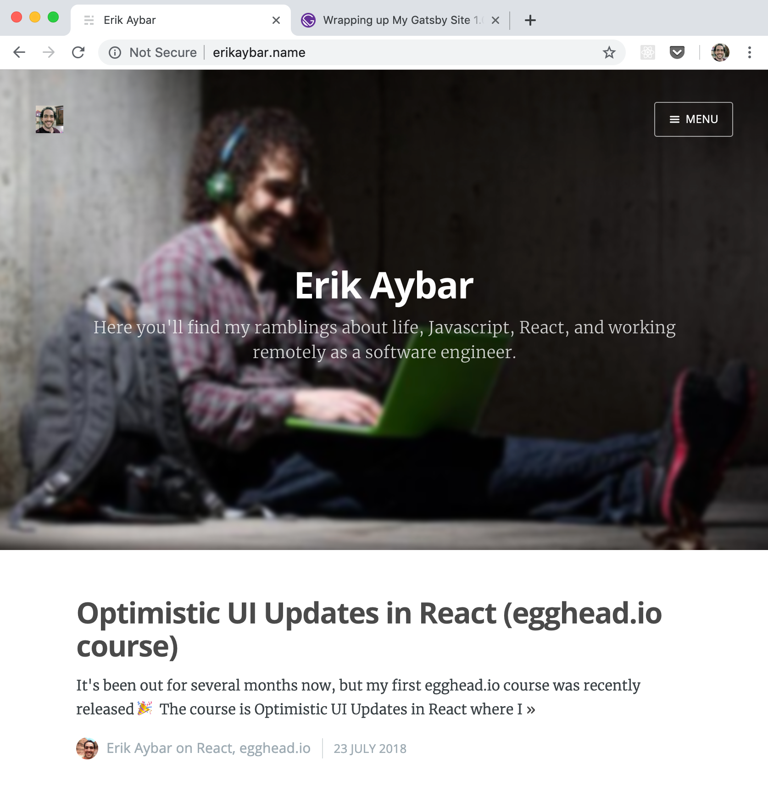
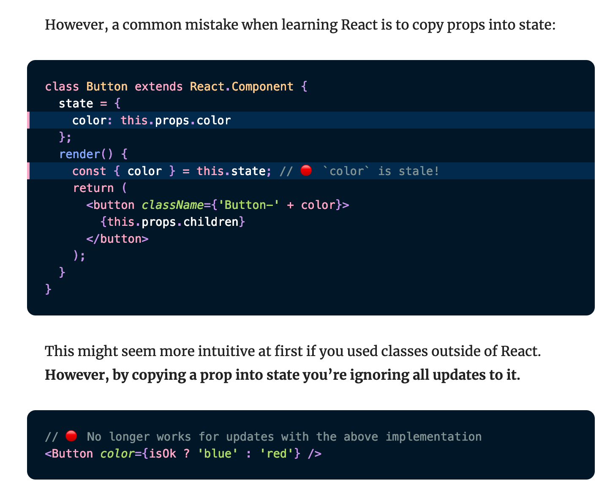
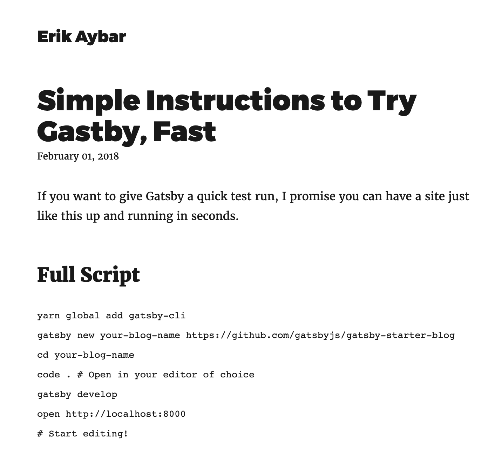
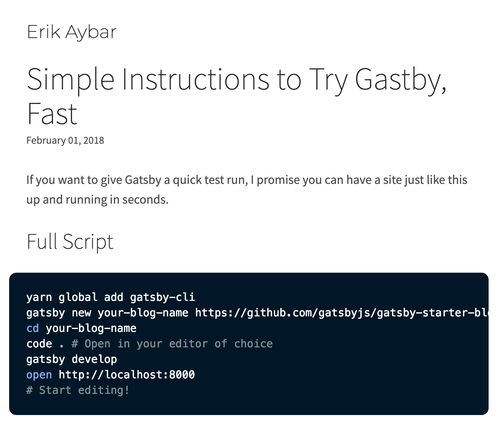
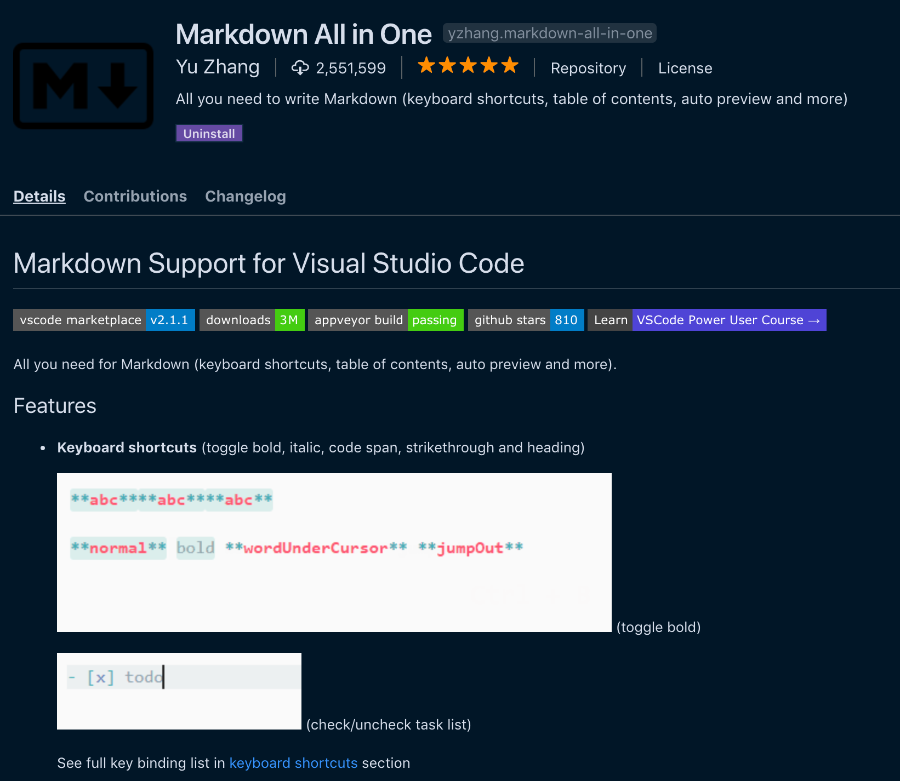

I've been dabbling with Gatsby, but also wanting to get back into the swing of writing and get a fresh site up. Time to wrap this up!

Here a some of the reasons and excuses that have held me back from taking this live and replacing my Ghost blog.



## Procrastination

This is the biggest reason.

## Syntax Highlighting

First you have to understand how great [Dan Abramov's overreacted.io](https://overreacted.io/writing-resilient-components/) syntax highlighting looks:



This is based on [Sarah Drasner's](https://twitter.com/sarah_edo) wonderful [Night Owl VS Code theme](https://github.com/sdras/night-owl-vscode-theme)

I wanted that. Fortunately, Dan has open sourced his blog and the source is available on GitHub. I was able to poke around and find out [where the styles were coming from](https://github.com/gaearon/overreacted.io/blob/bbe55c14e2a796d22d503489e6323ba2499cfc7e/src/utils/global.css#L79-L239)!

And voilà! ✨

```jsx{4,10}
// Source: https://overreacted.io/writing-resilient-components/
class Button extends React.Component {
  state = {
    textColor: slowlyCalculateTextColor(this.props.color),
  }
  render() {
    return (
      <button
        className={
          'Button-' + this.props.color + ' Button-text-' + this.state.textColor // 🔴 Stale on `color` prop updates
        }
      >
        {this.props.children}
      </button>
    )
  }
}
```

📝 TODO: Extract and publish as a standalone package.
📝 TODO: Figure out how to enable syntax highlighting for inline code.

**Before**



**After**



## Ease of writing

### Reduce friction for beginning a new post

Automate this with a script! Inspired by https://joelhooks.com/a-handy-npm-script-for-creating-a-new-gatsby-blog-post

**Command**

```bash
yarn new-post 'My new greatest post!'
```

**Output**

```md
---
slug: my-new-greatest-post
date: 2019-03-24
title: 'My new greatest post!'
published: false
---

TODO: Write about My new greatest post!
```

### Markdown related keyboard shortcuts

I just am now discovering the Markdown All in One extension. So far it feels like a great addition to VS Code considering I use it as my primary markdown editor!



## Converting my Ghost posts

I don't imagine this is going to be _too hard_, but I've been putting it off. I've debated just scrapping everything I've written up until now, but that might make me too sad. I need to figure out how to automate this process. I know [Kyle Shevlin](https://kyleshevlin.com/) has some experience with this. There might even be a live stream recorded up somewhere that I can learn a thing or two from 🌱...

## GraphQL and Frontmatter things

At the minimum, I want to implement:

- `frontmatter.published: boolean` so I can control which posts are live or in draft format.
  - 📝Alternative approach to consider here https://chaseonsoftware.com/gatsby-drafts/#how-i-write-drafts-in-gatsby
- `frontmatter.slug: string` to give me control over post URIs

Bonus features I have in mind:

- `frontmatter.post-type: string` Not sure on naming yet here, but I'd like to have a few different "types" of posts with different purposes.
  - Example post "types" and roughly what I'm envisioning
    - Dev log: Brief, brain dumps logging things I've learned or accomplished. Quality: low, Frequency: medium.
    - Quick tip: Brief, standalone tips distilled down to share. Quality: medium, Frequency: high.
    - Post: Full fledged blog post. Something I've put effort into writing/editing. Quality: high, Frequency: low.
  - I know I've seen examples of this out in the wild, I'll have to dig it up and share/poke around.
- `frontmatter.spoiler: string` Inspired by [https://overreacted.io/](https://overreacted.io/) (see [example](https://github.com/gaearon/overreacted.io/blob/bbe55c14e2a796d22d503489e6323ba2499cfc7e/src/pages/writing-resilient-components/index.md#L4))
- Night mode 🌔 ↔️ ☀️
- Pages such as: Portfolio, About Me, etc...
- Surely many more...
