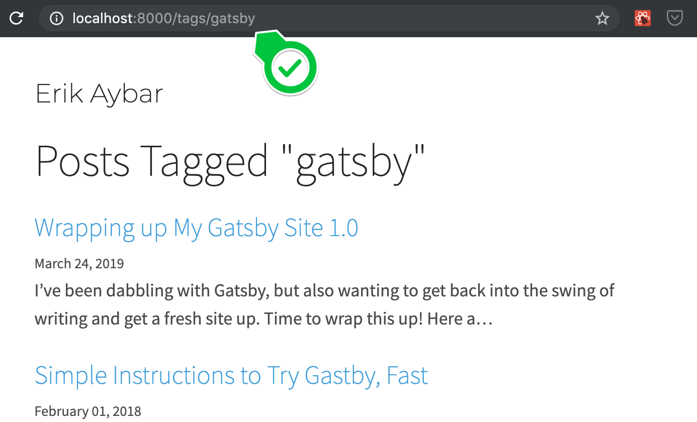
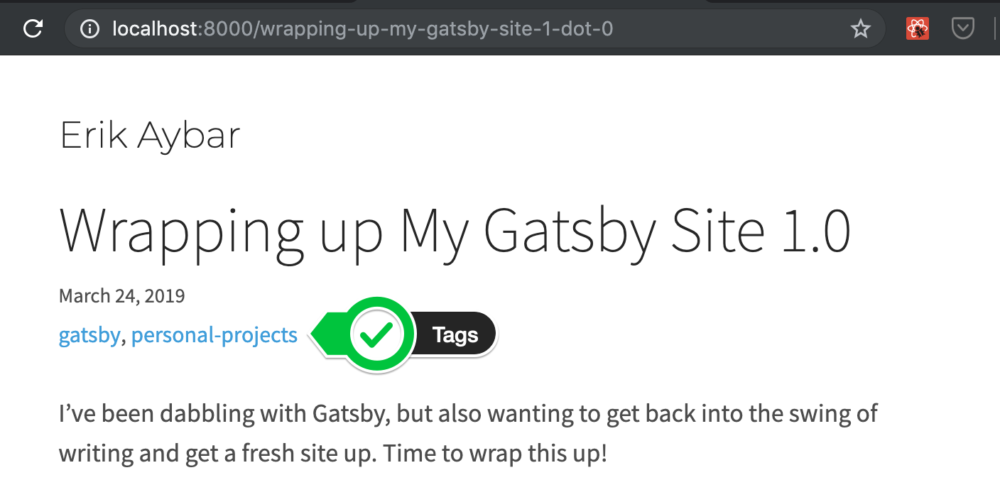

Before migrating my existing posts over from Ghost, I needed to implement tags on this Gatsby blog. Fortunately, the Gatsby docs once again have a great guide for exactly this: [Creating Tags Pages for Blog Posts](https://www.gatsbyjs.org/docs/adding-tags-and-categories-to-blog-posts/).

This is my own condensed version with some additional thoughts thrown in as I implement this on my own blog.

**As an author, I should be able to:**

- [ ] Add tags to posts via frontmatter

**As a reader, I should be able to:**

- [ ] See what tags a post has when viewing the post
- [ ] View posts filtered by a specific tag at `/tags/:tag`

## 0) Add tags to posts via frontmatter

Tags are nothing more than another frontmatter field. In this case `frontmatter.tags` is an array of strings. This field should be considered optional (not all posts _must_ have tags).

```markdown{3}
---
slug: adding-tags-to-a-gatsby-blog
tags: ['gatsby', 'quick-tips']
date: 2019-03-29
title: 'Adding tags to a Gatsby blog'
---
```

📝 Read more about frontmatter here: https://www.gatsbyjs.org/packages/gatsby-transformer-remark/

## 1) Create "/tags/:tag" pages to display posts filtered by tag



**Create a page template**

```javascript{22}
// src/templates/TagPage.js
// ...
export default function TagPage({
  location,
  pageContext: {tag},
  data: {
    allMarkdownRemark,
    site: {siteMetadata},
  },
}) {
  return (
    <Layout location={location} title={siteMetadata.title}>
      <div>
        <SEO title={`Posts tagged "${tag}"`} keywords={[tag]} />
        <h1>Posts Tagged "{tag}"</h1>
        <PostsList posts={allMarkdownRemark.edges} />
      </div>
    </Layout>
  )
}

// Be sure the query contains frontmatter.tags
export const pageQuery = graphql`...`
```

**Add `tags` to the GraphQL query in `gatsby-node.js`**

```graphql{8}
{
  allMarkdownRemark() {
    edges {
      node {
        fields {slug}
        frontmatter {
          title
          tags
        }
      }
    }
  }
}
```

**Create a page for each unique tag**

```javascript{7,22-28}
// gatsby-node.js
exports.createPages = ({graphql, actions}) => {
  const {createPage} = actions
  return graphql(query).then(({errors, data}) => {
    const {edges: posts} = data.allMarkdownRemark
    // Other createPage usages etc...
    createTagsPages({posts, createPage})
  })
}

function createTagsPages({posts, createPage}) {
  const tagPage = path.resolve(`./src/templates/TagPage.js`)

  // Build up list of unique tags
  const allTags = new Set()
  posts.forEach(({node: {frontmatter: {tags}}}) => {
    if (!Array.isArray(tags)) return
    tags.forEach(tag => allTags.add(tag))
  })

  allTags.forEach(tag => {
    createPage({
      path: `/tags/${slugify(tag)}`,
      component: tagPage,
      context: {
        tag,
      },
    })
  })
}
```

## 2) Display tags in the post template



**Create `TagsList` component that accepts props `{tags?: string[]}`**

```javascript
// src/components/TagsList.js
import * as React from 'react'
import styled from 'styled-components'
import {tagToPath} from '../utils/paths'

export function TagsList({tags, ...otherProps}) {
  if (!tags || tags.length === 0) {
    return null
  }

  return (
    <Ul {...otherProps}>
      {tags.map(tag => (
        <Li key={tag}>
          <a key={tag} href={tagToPath(tag)}>
            {tag}
          </a>
        </Li>
      ))}
    </Ul>
  )
}

// ...
```

**Add `<TagsList />` to the primary post template**

```javascript{15}
// src/templates/blog-post.js
import React from 'react'
// ...
import {TagsList} from '../components/TagsList'

function BlogPostTemplate({data, pageContext, location}) {
  const post = data.markdownRemark
  const siteTitle = data.site.siteMetadata.title

  return (
    <Layout location={location} title={siteTitle}>
      <SEO title={post.frontmatter.title} description={post.excerpt} />
      <h1>{post.frontmatter.title}</h1>
      <small>{post.frontmatter.date}</small>
      <TagsList tags={post.frontmatter.tags} />
      {/* ... */}
    </Layout>
  )
}
```

---

And that's about it! You should now have basic tagging set up and be able to:

- [x] Add tags to posts via frontmatter
- [x] See what tags a post has when viewing the post
- [x] View posts filtered by a specific tag at `/tags/:tag`

📝 For a full diff, see the related pull request here: [Implement frontmatter.tags and "/tags/:tag" pages](https://github.com/erikthedeveloper/erikaybar.name-gatsby/pull/1)
